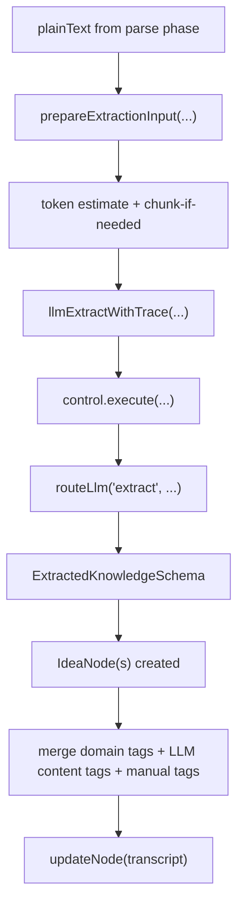

# YouTube Transcript Ingestion

Documents the ingestion pipeline for YouTube videos: how transcripts are fetched, parsed, and
stored as `transcript` nodes in the vault.

For the broader orchestration architecture around harness prep, control, command routing, and run
observability, see [07 — Orchestration and adapters](07_ORCHESTRATION_AND_ADAPTERS.md).

For **YouTube subscription status** (`youtube_subscribed` on `SourceNode`, Google OAuth setup, and
refresh-token renewal, see [YouTube OAuth](/docs/integrations/youtube-oauth.md).

---

## Overview

The pipeline has two phases — transcript save always completes first; extraction is best-effort:

| Phase      | What happens                                                                            |
| ---------- | --------------------------------------------------------------------------------------- |
| 1. Ingest  | `yt-dlp` downloads metadata + subtitles → parse → store `TranscriptNode` + `SourceNode` |
| 2. Extract | LLM extracts ideas + summary → create `IdeaNode`s, update transcript `summary` field    |

Phase 1 never fails due to LLM issues. Phase 2 failure is surfaced as a warning in the UI
("Extraction failed — retry from the transcript page") but the transcript is always persisted.

---

## Key Files

| File                                                   | Role                                                    |
| ------------------------------------------------------ | ------------------------------------------------------- |
| `packages/core/src/utils/vault-root.ts`                | Single source of truth for `VAULT_ROOT`                 |
| `packages/ingestion/src/fetch/youtube.ts`              | Calls `yt-dlp`, returns raw transcript string           |
| `packages/ingestion/src/structure/srt-parser.utils.ts` | Parses VTT/SRT into timestamped paragraphs              |
| `packages/ingestion/src/pipeline.ts`                   | Orchestrates fetch → parse → store → extract            |
| `packages/ingestion/src/extract/llm-extract.ts`        | LLM knowledge extraction via `@llaab/control`           |
| `packages/skills/src/ingest-youtube.ts`                | Entry point — calls pipeline then auto-tries extraction |

---

## Vault Path Resolution

All vault writes resolve to the same directory regardless of where the process starts from
(`pnpm exec`, web server, test runner). The canonical path is exported from `@llaab/core`:

```ts
import { VAULT_ROOT } from "@llaab/core";
```

The implementation in `packages/core/src/utils/vault-root.ts` anchors to its own file location
via `import.meta.url` rather than `process.cwd()`. This means the server, tests, and CLI scripts
all resolve to the same
`vault/` at the monorepo root.

Override with the `LLAAB_VAULT` env var for non-standard layouts:

```bash
LLAAB_VAULT=/custom/path pnpm exec bun -e "..."
```

---

## Subtitle Format

### Why VTT, not SRT

`yt-dlp` is called with `--sub-format "vtt/best"`. VTT is preferred over SRT because:

- VTT is YouTube's native auto-caption format — less lossy in conversion
- SRT often truncates the final sentence of the video; VTT captures it fully
- VTT timestamps use `.` separators (e.g. `00:00:03.679`) — handled by the parser's `[.,]` regex

The loader tries `.en.vtt` first, then falls back to `.en.srt` for older cached files or videos
where VTT is unavailable.

### Detection

`isSrtFormat()` in `srt-parser.utils.ts` returns `true` for both formats:

- VTT — detected by the `^WEBVTT` header
- SRT — detected by the `\d+\n<timestamp> -->` pattern

Both are routed through `parseSrtTranscript` in the pipeline.

---

## Parsing Pipeline

```
raw VTT/SRT
    │
    ▼
parseSrtCues()          — split into individual timed cue objects
    │
    ▼
deduplicateCues()       — remove overlapping repeated text
    │
    ▼
assembleParagraphs()    — group cues into paragraphs by pause/sentence-count
    │
    ▼
trim trailing fragment  — strip any incomplete sentence at the very end
    │
    ▼
structuredContent       — <!-- t:M:SS --> markers + paragraph text
```

### Deduplication

YouTube auto-generated captions are heavily overlapping — each cue typically starts mid-sentence
from the previous cue. `deduplicateCues()` tracks a running string and only appends the suffix of
each new cue that isn't already present.

If a cue's text is fully contained in the running string, it is silently dropped. This prevents
doubled tail fragments when the final cue is a pure repeat of content just added.

### Trailing Sentence Trim

After paragraph assembly, the last paragraph is checked for a trailing incomplete sentence. If the
paragraph does not end with `.`, `!`, or `?` (optionally followed by closing punctuation), everything
after the last sentence-ending character is stripped.

This is a defence-in-depth guard: even when VTT provides better coverage, the auto-caption
generator can still cut off mid-word at the very end of a video.

### Example

```
Before trim:
  "...in the academy link in the description. The command center first version is launching next"

After trim:
  "...in the academy link in the description."
```

---

## Paragraph Formatting

Each paragraph in `structuredContent` is prefixed with an HTML comment timestamp:

```markdown
<!-- t:0:00 -->

First paragraph of speech...

<!-- t:0:42 -->

Second paragraph of speech...
```

These markers are invisible in Obsidian reading view but parseable by code. A future wiki-compile
step can convert them to clickable YouTube deep-links.

### Paragraph break triggers

A new paragraph starts when **both** conditions are met:

1. A gap > `pauseThresholdSeconds` (default `1.5s`) between cues **and** the current paragraph ends
   with sentence punctuation, **or** the paragraph has accumulated ≥ `maxSentencesPerParagraph`
   (default `6`) complete sentences
2. The paragraph has been running for at least `minParagraphSeconds` (default `25s`)

---

## Extraction Phase

After the transcript is stored, `ingestYouTube` calls `extractKnowledgeFromTranscript`:



Extraction uses the `local-mid` model tier. Override with `LLAAB_LOCAL_MID_MODEL` in `.env`.
If extraction fails, the transcript is unaffected — the error is logged and returned as
`extractionError` in the API response.

Generated ideas and updated transcripts merge three tag sources:

- domain tags from `autoTag(title, body)`
- normalized LLM content tags from extraction output
- any existing/manual tags already present on the node

---

## Deduplication (node level)

Before fetching, the pipeline checks whether a `transcript` node with the same `source_type:
'youtube'` and `source_item_id` (the video ID) already exists in the vault. If found, the existing
node is returned immediately without re-fetching.

---

## Running Ingestion

```bash
pnpm exec bun -e "
import { ingestYouTube } from './packages/skills/src/ingest-youtube.ts';
await ingestYouTube({
  url: 'https://www.youtube.com/watch?v=<VIDEO_ID>',
  tags: ['my-tag'],
});
"
```

To re-ingest the same video (e.g. after a code change), clean recent vault activity first:

```bash
pnpm dev:clean:vault:recent
```

---

## Troubleshooting

| Symptom                                | Likely cause                                            | Fix                                                                                  |
| -------------------------------------- | ------------------------------------------------------- | ------------------------------------------------------------------------------------ |
| `yt-dlp` not found                     | Not installed or not on PATH                            | `brew install yt-dlp`                                                                |
| Transcript empty                       | Video has no auto-captions                              | Expected — node is stored without body                                               |
| Final sentence cut short               | SRT truncation (pre-fix state)                          | Pipeline now uses VTT + sentence trim                                                |
| Duplicate sentence at end              | Last-cue force-add bug (pre-fix state)                  | Fixed — fully-contained cues are dropped                                             |
| Re-ingest returns existing node        | Node dedup matched on `source_item_id`                  | Run `pnpm dev:clean:vault:recent` first                                              |
| Extraction failed — transcript saved   | LLM model not running or wrong model name               | Check Ollama is running; set `LLAAB_LOCAL_MID_MODEL` in `.env` to an installed model |
| Ideas created but body is empty        | Expected — idea body is intentionally empty             | The title phrase IS the idea content                                                 |
| Missing `youtube_subscribed` on source | OAuth refresh token invalid or enrich not run           | See [YouTube OAuth](/docs/integrations/youtube-oauth.md)                             |
| `invalid_grant` on subscription check  | Stale/wrong refresh token or Playground client mismatch | Re-issue token per [YouTube OAuth](/docs/integrations/youtube-oauth.md)              |
