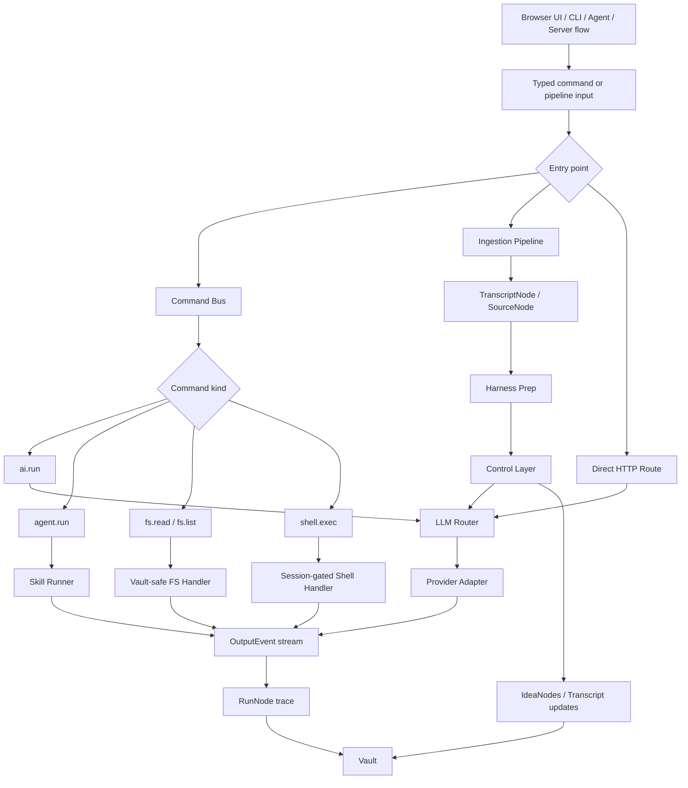
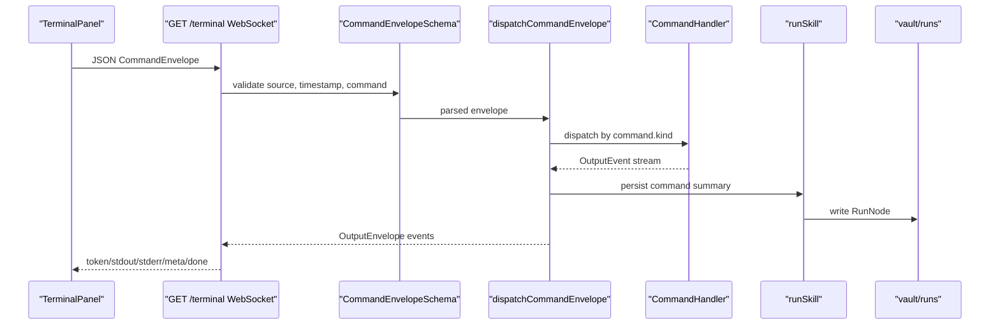
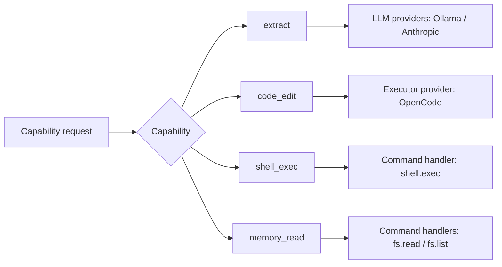
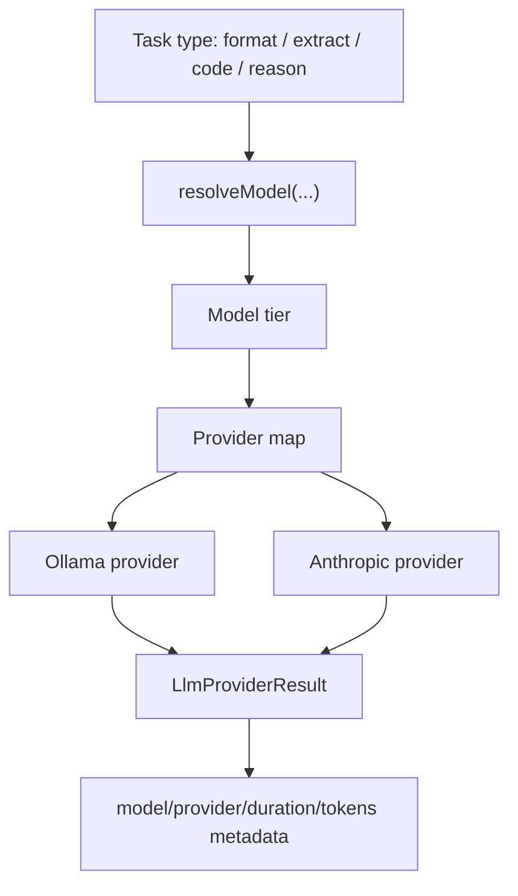
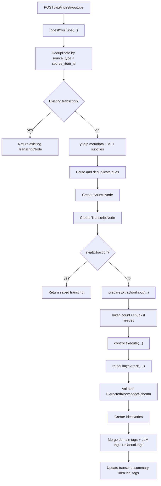
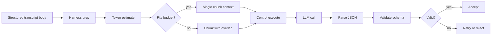
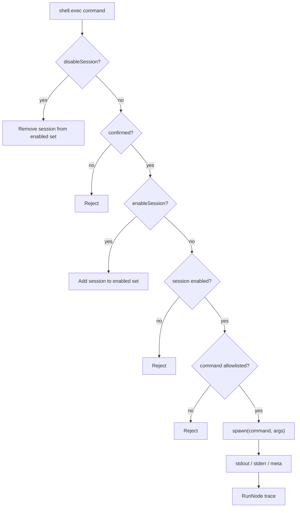
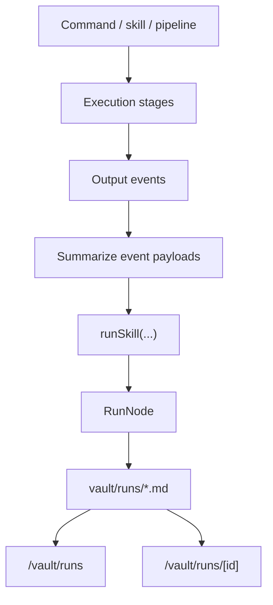

# LLAAB — Orchestration and Adapters

This document is the architecture reference for LLAAB's orchestration layer: how user actions,
ingestion, LLM calls, agents, command handlers, adapter-like providers, and execution traces move
through the system.

It is not a recap of implementation phases. It describes the current architecture and the stable

mental model agents should use when extending it.

---

## Vocabulary

LLAAB uses the [glossary](../LLAAB_GLOSSARY.md) as the canonical shared vocabulary. The terms below
are especially important for orchestration:

| Term         | Meaning in orchestration                                                 |
| ------------ | ------------------------------------------------------------------------ |
| `node`       | One typed knowledge object stored in the vault.                          |
| `vault`      | File-based source of truth for nodes and run traces.                     |
| `transcript` | Durable input surface created by ingestion and later used by extraction. |
| `idea`       | Structured insight extracted from content or captured manually.          |
| `skill`      | Reusable executable knowledge.                                           |
| `run`        | One execution record, persisted as a `RunNode`.                          |
| `pipeline`   | Ordered stages that transform an input into an output.                   |
| `control`    | Governance layer around model-facing execution.                          |
| `harness`    | Deterministic preparation layer before governed LLM calls.               |
| `taxonomy`   | `d:` domain tag system, including auto-tagging from title/body content.  |
| `RAG`        | Retrieval/context-selection pattern; not intelligence by itself.         |

The important architectural distinction is:

```txt
ingestion = content moves into the lab
extraction = structure comes out of saved content
execution = a skill, command, or adapter performs work
run logging = execution becomes inspectable knowledge
```

---

## System Shape

LLAAB now has one orchestration path shared by browser UI, CLI, agents, and server-side flows:



The system is intentionally layered:

| Layer           | Primary files                                                              | Responsibility                                      |
| --------------- | -------------------------------------------------------------------------- | --------------------------------------------------- |
| Schema          | `packages/schemas/src/*.schema.ts`                                         | Defines valid node and trace shapes.                |
| Core            | `packages/core/src/*`                                                      | Vault IO, taxonomy, command protocol, capabilities. |
| Harness prep    | `packages/ingestion/src/extract/harness-prep.ts`                           | Token-aware context preparation for extraction.     |
| Control         | `packages/control/src/orchestrator.ts`                                     | Governed model execution and schema validation.     |
| LLM routing     | `packages/llm/src/router.ts`, `packages/llm/src/providers/*`               | Task-to-provider/model routing.                     |
| Skills          | `packages/skills/src/*`                                                    | Ingest, agent, and reusable execution flows.        |
| Server routes   | `apps/server/src/routes/*`, `apps/server/src/commands/*`                   | HTTP, WebSocket, and command dispatch.              |
| Client surfaces | `apps/client/src/routes/*`, `apps/client/src/components/TerminalPanel.tsx` | Browser routes and terminal command surface.        |
| CLI diagnostics | `packages/cli/src/commands/*`                                              | Local diagnostics and adapter visibility.           |

---

## Browser Surfaces

These are the main browser routes that expose orchestration state:

| Browser route             | Purpose                                                              |
| ------------------------- | -------------------------------------------------------------------- |
| `/ingest`                 | YouTube ingestion form; creates transcripts and optionally extracts. |
| `/llm`                    | LLM status/model interaction surface.                                |
| `/terminal`               | Typed command bus UI over the `/terminal` WebSocket.                 |
| `/vault/transcripts`      | Transcript index.                                                    |
| `/vault/transcripts/[id]` | Transcript detail, extraction metadata, ideas, and retry extraction. |
| `/vault/nodes`            | General node index.                                                  |
| `/vault/nodes/[id]`       | Idea/skill/resource/source node detail.                              |
| `/vault/runs`             | Run trace index.                                                     |
| `/vault/runs/[id]`        | Execution trace detail, including command and model metadata.        |

The UI should read orchestration state from nodes and run traces rather than reconstructing hidden
state from client memory.

---

## Server Endpoints

The server is a Hono app. Route groups are mounted under `/api`, except the Terminal Panel
WebSocket at `/terminal`.

| Endpoint                             | Method | Purpose                                             |
| ------------------------------------ | ------ | --------------------------------------------------- |
| `/terminal`                          | WS     | Terminal Panel command stream.                      |
| `/api/ingest/youtube`                | POST   | Ingest a YouTube URL and optionally run extraction. |
| `/api/llm/complete`                  | POST   | Non-streaming model call through `routeLlm(...)`.   |
| `/api/llm/stream`                    | POST   | SSE model stream through `streamLlm(...)`.          |
| `/api/llm/models`                    | GET    | Installed Ollama model list.                        |
| `/api/llm/status`                    | GET    | Provider availability and routing map.              |
| `/api/llm/capabilities`              | GET    | Provider capabilities.                              |
| `/api/vault/file?path=...`           | GET    | Read a vault-root-safe file path.                   |
| `/api/vault/nodes`                   | GET    | List validated nodes.                               |
| `/api/vault/nodes`                   | POST   | Create a vault node.                                |
| `/api/vault/nodes/:id`               | GET    | Read one node by id.                                |
| `/api/vault/transcripts/:id/ideas`   | GET    | List ideas extracted from one transcript.           |
| `/api/vault/transcripts/:id/extract` | POST   | Re-run extraction on a saved transcript.            |
| `/api/vault/transcripts/:id`         | DELETE | Discard a transcript.                               |
| `/api/runs`                          | GET    | List `RunNode` traces.                              |
| `/api/runs/:id`                      | GET    | Read one `RunNode` trace.                           |

### Example LLM request

```ts
await fetch("http://localhost:8888/api/llm/complete", {
  method: "POST",
  headers: { "Content-Type": "application/json" },
  body: JSON.stringify({
    task: "extract",
    prompt: "Extract three reusable ideas from this note.",
  }),
});
```

---

## Command Bus

The command bus is the shared typed execution boundary for the Terminal Panel and any future
command-driven surfaces. It is intentionally not a shell.



### Command envelope

Every inbound command is wrapped with correlation metadata:

```ts
import type { CommandEnvelope } from "@llaab/core";

const envelope: CommandEnvelope = {
  id: crypto.randomUUID(),
  source: "terminal",
  timestamp: new Date().toISOString(),
  command: {
    kind: "ai.run",
    task: "extract",
    prompt: "Extract ideas from this note.",
  },
};
```

### Command types

```ts
type Command =
  | {
      kind: "ai.run";
      task: "format" | "extract" | "code" | "reason";
      prompt: string;
    }
  | { kind: "agent.run"; nodeId?: string; force?: boolean }
  | { kind: "fs.read"; path: string }
  | { kind: "fs.list"; path: string }
  | {
      kind: "shell.exec";
      sessionId: string;
      command?: string;
      args?: string[];
      cwd?: string;
      confirmed?: boolean;
      enableSession?: boolean;
      disableSession?: boolean;
    };
```

### Output events

Handlers yield `OutputEvent` values. The bus wraps each event as an `OutputEnvelope` and persists a
summary to a `RunNode`.

```ts
type OutputEvent =
  | { type: "token"; data: string }
  | { type: "stdout"; data: string }
  | { type: "stderr"; data: string }
  | { type: "meta"; data: Record<string, unknown> }
  | { type: "error"; message: string; code?: string }
  | { type: "done"; code: number };
```

---

## Capability Routing

Capabilities describe what an adapter-like provider or command can do. Routing should prefer
capability names over provider names.



Current command capability mapping lives in `packages/core/src/capability.ts`:

| Command kind | Capabilities                               |
| ------------ | ------------------------------------------ |
| `ai.run`     | `chat`, `extract`, `reason`, `command_run` |
| `agent.run`  | `agent_run`, `skill_run`, `command_run`    |
| `fs.read`    | `memory_read`, `command_run`               |
| `fs.list`    | `memory_read`, `command_run`               |
| `shell.exec` | `shell_exec`, `command_run`                |

LLM providers and executor providers also declare capabilities. This lets CLI diagnostics and
future routing decisions ask "who can do `extract`?" rather than "is Ollama installed?"

Useful CLI commands, run from your normal OS/project terminal at the repo root, not from the
browser Terminal Panel:

```bash
pnpm dev:cli -- doctor
pnpm dev:cli -- adapters list
pnpm dev:cli -- adapters list --capability extract
pnpm dev:cli -- route extract
pnpm dev:cli -- route code_edit
```

If the `@llaab/cli` package has been built and linked onto your shell `PATH`, the shorter
`lab doctor` form is equivalent. The browser Terminal Panel accepts typed orchestration
commands such as `ai.run`, `agent.run`, `fs.read`, `fs.list`, and gated `shell.exec`; it is not the
primary place to run `lab ...` CLI diagnostics.

---

## LLM Providers

The LLM layer is the model/provider adapter boundary. Browser routes, command handlers, extraction,
and diagnostics all route through the same provider map.



Provider responsibilities:

- expose `complete(...)` and streaming behavior
- report availability through `isAvailable()`
- return metadata such as provider, model, duration, and token usage when available
- keep provider SDK details inside `packages/llm`

Consumers should not import provider SDKs directly.

---

## Ingestion and Extraction

YouTube ingestion is the most complete orchestration pipeline. It separates deterministic ingest
from best-effort extraction.



Phase 1 ingest always preserves the transcript if fetch/parse succeeds. Phase 2 extraction can fail
without losing the transcript.

### Extraction handoff contract

```ts
import { extractKnowledgeFromTranscript } from "@llaab/ingestion";

const extraction = await extractKnowledgeFromTranscript(
  transcriptId,
  transcriptFilePath,
  transcriptBody,
);

console.log(extraction.ideaIds);
console.log(extraction.summary);
```

The extraction layer is responsible for:

- preparing model-facing context with the harness
- validating model output through control
- normalizing LLM-suggested content tags
- merging tags from domain auto-tagging, model content tags, and manual tags
- writing idea nodes and updating transcript metadata

---

## Harness and Control

Harness and control are adjacent but distinct.



Harness answers: "What should the model receive?"

Control answers: "Was the model-facing execution acceptable?"

This keeps deterministic preparation, model execution, and output governance from collapsing into
one hard-to-debug function.

---

## Terminal Panel

The Terminal Panel is a browser UI for typed commands. It connects to the same origin via Vite proxy (`ws://localhost:3000/terminal` → Bun on `:8888`).
by default, derived from `PUBLIC_SERVER_URL`.

Supported commands:

```txt
ai.run extract "Summarize this note into three ideas"
agent.run --force
fs.list transcripts
fs.read transcripts/transcript.example.md
shell.exec --enable-session --confirm
shell.exec --confirm node --version
shell.exec --disable-session
```

The parser in `TerminalPanel.tsx` converts these strings into typed commands before sending them to
the server. The server validates them again with Zod.

---

## Shell Adapter Safety

`shell.exec` is intentionally last in the stack. It is a local development escape hatch, not the
normal orchestration model.



Rules:

- no raw shell string is accepted
- binary and arguments are separate fields
- session must be enabled explicitly
- actual execution still requires `confirmed: true`
- command must be allowlisted
- stdout/stderr are streamed and summarized into the run trace

Current allowlist:

```ts
const ALLOWED_SHELL_COMMANDS = new Set([
  "git",
  "pnpm",
  "node",
  "yt-dlp",
  "opencode",
]);
```

---

## RunNode Observability

Every command dispatched through the command bus persists a run summary. Ingestion and skill
execution also write `RunNode` traces.



Run traces are system knowledge. They answer:

- what was attempted
- what input or command was used
- which capabilities were involved
- whether execution succeeded
- what model/provider/tool metadata was reported
- which nodes were produced or updated

This is why the command bus persists even small command runs: if work affects the lab, it should be
inspectable later.

---

## Extension Rules

When adding orchestration behavior:

1. Add or reuse a glossary term before inventing new language.
2. Prefer typed commands and Zod schemas over free-form strings.
3. Route by capability, not provider name.
4. Keep provider SDKs inside adapter/provider packages.
5. Keep deterministic ingestion separate from model-facing extraction.
6. Put token/chunk/context preparation in harness prep.
7. Put model-output validation and retry decisions in control.
8. Persist execution through `RunNode` when work is performed.
9. Keep shell execution opt-in, session-gated, confirmed, and allowlisted.

---

## Related Documentation

| Doc                                                                               | Relationship                                  |
| --------------------------------------------------------------------------------- | --------------------------------------------- |
| [01 — Overview](01_OVERVIEW.md)                                                   | Schema/vault foundation.                      |
| [02 — Node types and schemas](02_NODE_TYPES_and_SCHEMAS.md)                       | Node and `RunNode` shapes.                    |
| [05 — Control layer and execution model](05_CONTROL_LAYER_AND_EXECUTION_MODEL.md) | Control-layer principles.                     |
| [06 — YouTube transcript ingestion](06_YOUTUBE_TRANSCRIPT_INGESTION.md)           | Detailed ingest/extract pipeline.             |
| [Taxonomy guide](taxonomy/TAXONOMY_GUIDE.md)                                      | Domain tag vocabulary and auto-tagging rules. |
| [Terminal Panel plan](todo/TODO_TERMINAL_PANEL.md)                                | Historical terminal design plan.              |
| [Orchestration implementation plan](todo/DONE_ORCHESTRATION.md)                   | Completed implementation checklist.           |
