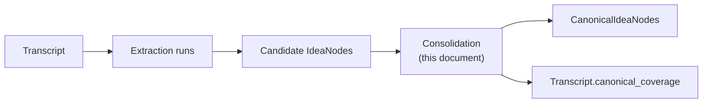
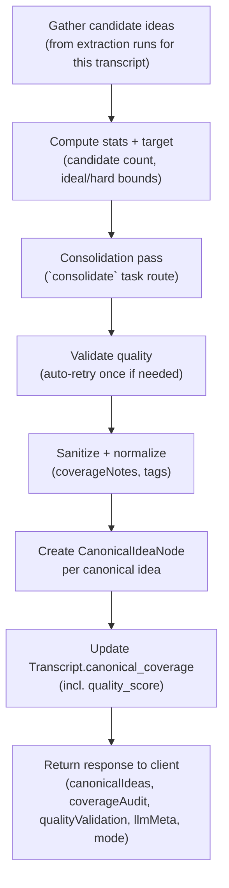
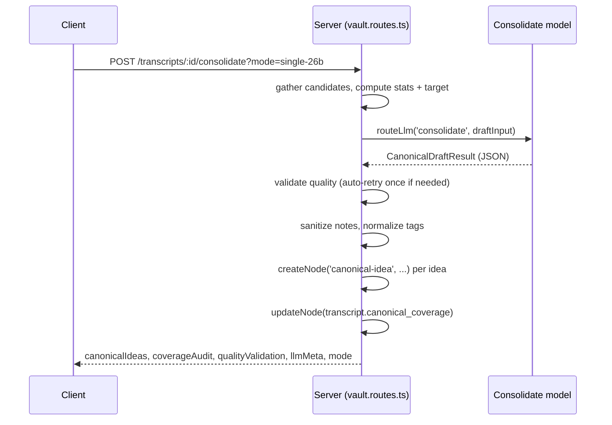
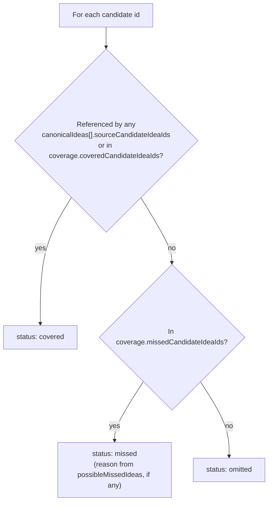

# LLAAB — Canonical Idea Consolidation

This document is the technical reference for **canonical idea consolidation**: the process that
turns the candidate ideas extracted from a transcript's extraction runs into a small set of
durable, deduplicated `canonical-idea` nodes.

It covers the single-pass LLM pipeline, the two quality modes, deterministic validation and
scoring, the input/output shapes exchanged with the model, and the post-processing applied before
nodes are written to the vault.

---

## Vocabulary

LLAAB uses the [glossary](../LLAAB_GLOSSARY.md) as the canonical shared vocabulary. The terms below
are specific to consolidation:

| Term                   | Meaning in consolidation                                                                    |
| ---------------------- | ------------------------------------------------------------------------------------------- |
| `candidate idea`       | An `IdeaNode` produced by an extraction run for a transcript — raw, unreviewed material.    |
| `canonical idea`       | A `CanonicalIdeaNode` — a deduplicated, durable idea derived from one or more candidates.   |
| `consolidation pass`   | The single LLM call that turns all candidates into a canonical idea set.                    |
| `possible missed idea` | A candidate (or cluster) the model flagged as not yet represented.                          |
| `coverage`             | Per-candidate bookkeeping: covered / omitted / missed, stored on the transcript.            |
| `mode`                 | `fast` or `single-26b` — controls prompt style and model override.                          |
| `quality score`        | 0–100 deterministic score from `validateConsolidationQuality`; persisted on the transcript. |

---

## Where this fits



Consolidation is triggered manually from the transcript detail page (**Consolidate Canonical
Ideas** button) via `POST /api/vault/transcripts/:id/consolidate`. It does not run automatically —
LLAAB has no scheduler, per the agent-execution policy (`.github/instructions/project/agent-execution.instructions.md`).

---

## High-level pipeline

**Current behaviour:** one pass on the `consolidate` task route (strong model, e.g.
`gemma4:26b-a4b-it-qat` via `/llm` → Consolidation), followed by deterministic quality
validation (with optional auto-retry).



Implementation entry point: `consolidateTranscriptIdeas` in
[`apps/server/src/routes/vault/vault.routes.ts`](../apps/server/src/routes/vault/vault.routes.ts).

---

## Step 1 — Gathering candidates

For the target transcript, the handler:

1. Finds every `RunNode` whose `produced_node_ids` includes the transcript.
2. Collects every `IdeaNode` referenced by those runs' `produced_node_ids`.
3. Splits each idea's tags into `domains` (`d:*`) and `tags` (everything else) via `splitIdeaTags`.
4. Builds a `CandidateIdeaPayload` per idea:

```ts
interface CandidateIdeaPayload {
  id: string;
  runId: string;
  model?: string; // from IdeaNode.llm_model — which model originally extracted this idea
  title: string;
  body?: string;
  domains: string[];
  tags: string[];
}
```

If no candidates are found, the route returns `400 No candidate ideas found for this transcript.`

---

## Step 2 — Stats and target

Before calling the model, the handler computes two small objects sent in the consolidation prompt.
These give the model a sense of scale and a concrete count to aim for, without forcing an exact
number.

```ts
interface ConsolidationStats {
  candidateRunCount: number; // unique run ids among candidates
  candidateIdeaCount: number; // total candidates
  averageIdeasPerRun: number; // candidateIdeaCount / candidateRunCount
  uniqueCandidateTagCount: number; // distinct tags + domains across candidates
  sourceModels: string[]; // distinct IdeaNode.llm_model values
}

interface ConsolidationTarget {
  idealMin: number; // 4
  idealMax: number; // 6
  hardMin: number; // max(3, floor(candidateIdeaCount / 8))
  hardMax: number; // min(8, ceil(candidateIdeaCount / 4))
}
```

The target is framed to the model as **"a strong preference, not a quota"** — see
[Consolidation prompt rules](#consolidation-prompt-rules).

---

## Step 3 — Modes and model routing

Two modes control prompt style and model selection. Both run **one pass** on the `consolidate`
task route. The mode is selected via `?mode=` on the consolidate request (default: `single-26b`).
There is currently no UI mode selector — see [Future UX](#future-ux).

| Mode         | Prompt  | Model                     | Behaviour                                         |
| ------------ | ------- | ------------------------- | ------------------------------------------------- |
| `fast`       | full    | E4B (`extract` route)     | Single pass, fast preview.                        |
| `single-26b` | compact | 26B (`consolidate` route) | **Default.** Single compact pass on strong model. |

`?mode=balanced` and `?mode=best` are accepted as legacy aliases for `single-26b`.

Modes resolve through `getConsolidationConfig(mode)` in `vault.routes.ts`, which returns
`{ promptStyle, modelOverride? }`. `promptStyle: 'compact'` selects
`buildCanonicalCompactSystemPrompt(target)` instead of `buildCanonicalDraftSystemPrompt(target)` —
see [Consolidation prompt rules](#consolidation-prompt-rules).

Each `TaskType` is routed to an actual model via `packages/llm/src/router.ts` /
`configs/llm-routing.json`, and is editable from the **Models** page (`/llm`,
`LlmRoutingEditor.tsx`). Typical routing:

| Task          | Model (example)         | Tier           |
| ------------- | ----------------------- | -------------- |
| `consolidate` | `gemma4:26b-a4b-it-qat` | `local-strong` |



---

## Step 4 — Consolidation pass

### Input shape

`buildCanonicalDraftInput` sends the model a compact JSON payload — **never the full transcript
text, run markdown, or `output_summary.plainText`**:

```ts
type CanonicalDraftInput = {
  transcript: { id: string; title: string; summary?: string; tags: string[] };
  stats: ConsolidationStats;
  target: ConsolidationTarget;
  candidateIdeas: CandidateIdeaPayload[];
};
```

### Output shape

```ts
type CanonicalDraftResult = {
  canonicalIdeas: CanonicalIdeaDraft[];
  coverage: {
    coveredCandidateIdeaIds: string[];
    omittedCandidateIdeaIds: string[];
    missedCandidateIdeaIds: string[];
  };
  possibleMissedIdeas: PossibleMissedIdea[];
};

type CanonicalIdeaDraft = {
  title: string;
  body: string;
  tags: string[];
  domains: string[];
  confidence: 'low' | 'medium' | 'high';
  sourceCandidateIdeaIds: string[];
  keyClaims: string[];
  coverageNotes: string;
};

type PossibleMissedIdea = {
  title: string;
  reason: string;
  sourceCandidateIdeaIds: string[];
  recommendation: 'promote' | 'supporting_detail' | 'omit';
};
```

Validated by `CanonicalDraftResultSchema` / `CanonicalIdeaDraftSchema` /
`PossibleMissedIdeaSchema` in `vault.routes.ts`. Both camelCase and snake_case field names are
accepted and normalized (small models are inconsistent about casing), and `confidence` /
`recommendation` values are lower-cased and clamped to a valid enum rather than rejected outright.

### Consolidation prompt rules

`buildCanonicalDraftSystemPrompt` assembles the system prompt from:

1. **Count guidance** — the `target` range, framed as a preference:

   > Target output: 4–6 canonical ideas. Hard bounds: `{hardMin}`–`{hardMax}`. The target is a
   > strong preference, not a quota. Do not invent, pad, over-split, or promote weak ideas just to
   > hit the target.

2. **Category Separation Rule** — don't merge across categories of concern (workflow strategy,
   model behavior, historical role, interface/tooling architecture, runtime/sandboxing
   architecture, cost/performance implication) even if topically related.

3. **Problem/Solution Merge Rule** — merge a problem statement with its recommended solution into
   one canonical idea when they form one coherent concept.

4. **Context-Specific Rule** — context-stuffing/retrieval/token-cost candidates may merge into one
   idea, but must stay separate from a "large context windows cause non-determinism" idea (that's
   model-behavior, not context strategy).

5. **Bash-Specific Rule** — prefer one canonical idea capturing both "Bash as the first execution
   layer" and "Bash is limited".

6. **Typed/Runtime Split Rule** — keep typed execution layers separate from runtime isolation
   (V8 isolates, sandboxing).

7. **Single-Source Rule** — single-source clusters usually become supporting detail, not a
   canonical idea, unless the idea is technically specific, central to the transcript, and useful
   for future retrieval/linking — in which case mark `confidence: "medium"`.

`single-26b` mode uses `buildCanonicalCompactSystemPrompt(target)` instead. It keeps the count
guidance and a condensed version of rules 1–5 above, and adds explicit per-field limits — `body`
max 45 words, `tags` max 4, `domains` max 3, `keyClaims` max 2 — to keep the strong-model pass
short and fast.

The prompt also requires:

- Every canonical idea references at least one `sourceCandidateIdeaIds` entry.
- Every candidate id appears in exactly one of `coveredCandidateIdeaIds`,
  `omittedCandidateIdeaIds`, or `missedCandidateIdeaIds`.
- `coverageNotes` is plain-English and user-facing — never mentions internal process language
  (enforced again deterministically, see [Sanitizing coverage notes](#sanitizing-coverage-notes)).
- A closing reminder to double-check JSON validity.

---

## Step 4b — Quality validation and scoring

After the consolidation pass, `validateConsolidationQuality` in `packages/schemas/src/consolidation-quality.ts`
checks the result before nodes are written. A consolidation **warns** when:

- canonical idea count is below 4 or above 6
- covered candidates are below 80%
- any canonical idea lacks a `d:*` domain tag
- V8/runtime candidates exist but no canonical idea covers sandboxing or V8 isolates
- two or more non-determinism candidates exist but no **dedicated** canonical idea captures model
  behavior — a separate idea with `non-determinism` or `model-behavior` tag, non-determinism text in
  title/body, and non-determinism candidates as `sourceCandidateIdeaIds` (folding into a
  context-retrieval idea is not sufficient)
- Bash candidates exist but no canonical idea captures Bash as foundational but limited
- typed execution candidates exist but no canonical idea captures typed/programmable execution

`scoreConsolidationQuality` returns a **0–100** weighted score from the same checks. On failure the
handler **auto-retries once** (unless `?autoRetry=false`), persists the result anyway, returns
`qualityValidation` in the response, stores `quality_score` and an optional warning on
`transcript.canonical_coverage`, and the transcript UI shows **This consolidation looks incomplete**
with a **Regenerate** button. The quality score is also displayed in the Canonical Ideas header.

---

## Step 5 — Deterministic post-processing

Two cleanup passes run on the consolidation result before any nodes are written — these are pure
functions, not model calls.

### Sanitizing coverage notes

`sanitizeCoverageNotes(note)` rejects notes that leak internal process language. If the
(lower-cased) note contains any of:

```text
draft 0, draft 1, draft 2, audit, prompt, internal, consolidation process,
overarching narrative formed by combining drafts
```

...or is empty, it is replaced with the fallback:

> "Covers related candidate ideas about this concept."

### Normalizing tags

`normalizeCanonicalTags(tags, domains, title, body)`:

- Aliases known duplicate domain tags, e.g. `d:infrastructure` → `d:infra`.
- Drops `d:ingest` unless the idea's title/body actually mentions "ingest".
- Caps semantic tags at **5** and domain tags at **3** (after deduping via `dedupeTags`).

Final tag list written to the node is `dedupeTags([...domains, ...tags])`.

---

## Step 6 — Writing canonical idea nodes

For each `CanonicalIdeaDraft` in the result:

1. Filter `sourceCandidateIdeaIds` to only ids that exist in this transcript's candidate set. If
   none remain, the idea is **dropped** (it referenced ids outside this run's candidate pool).
2. Normalize tags/domains (Step 5).
3. `createNode('canonical-idea', ...)` with id `canonical-{transcriptId}-{index+1}-{timestamp}`,
   storing:
   - `transcript_id`, `source_candidate_idea_ids`, `confidence`, `key_claims`, `coverage_notes`
   - `llm_model` / `llm_provider` / `llm_duration_ms` / `llm_prompt_tokens` /
     `llm_completion_tokens` from the consolidation pass.

If **zero** canonical ideas survive filtering, the route returns
`422 Consolidation returned no valid canonical ideas.`

---

## Step 7 — Coverage tracking

`buildLegacyCoverage(candidates, result)` derives a per-candidate status for every candidate idea,
for both the persisted transcript field and the client response:



This is written to `TranscriptNode.canonical_coverage`:

```ts
{
  canonical_idea_ids: string[];          // ids of nodes created this run
  candidate_idea_ids: string[];          // all candidates considered
  covered_candidate_idea_ids: string[];
  omitted_candidate_idea_ids: Array<{ id: string; reason?: string }>;
  missed_candidate_idea_ids: Array<{ id: string; reason?: string }>;
  quality_score?: number;                // 0–100 from validateConsolidationQuality
  warning?: string;                      // quality validation message, if any
  updated_at: string;                    // ISO timestamp
}
```

`missed` candidates are surfaced in the transcript UI and can be promoted directly into a
canonical idea via `promoteCanonicalIdea` (`POST /transcripts/:id/canonical-ideas/promote`),
independent of a full re-consolidation.

### Re-consolidation conflict (only one set survives)

Running consolidation again on a transcript that already has a canonical-idea set is a **conflict**,
not an additive merge — re-consolidating must never leave two overlapping sets attached to the same
transcript. `consolidateTranscriptIdeas` captures `previousCoverage = transcript.canonical_coverage`
before running. The new canonical-idea nodes are always created on disk, but:

- If there was **no** previous set, `TranscriptNode.canonical_coverage` is overwritten immediately —
  same as before.
- If there **was** a previous set, the write is deferred: `canonical_coverage` is left pointing at
  the existing set, and the response carries `conflict: true` plus `existingCanonicalIdeaIds`,
  `existingQualityScore`, and `pendingCoverage` (the would-be new coverage record) instead.

The client's `CanonicalIdeaConflictWatcher` (mounted once in `AppLayout`, not the transcript page —
consolidation survives navigation, so the prompt must too) detects this purely from already-fetched
runs + transcripts (no extra endpoint needed to _detect_ a conflict — see its module doc comment),
shows a confirm dialog comparing `existingQualityScore` vs. the incoming `qualityValidation.score`,
then calls `POST /transcripts/:id/canonical-ideas/resolve-conflict` with `{ keep: 'existing' |
'incoming', incomingCanonicalIdeaIds, existingCanonicalIdeaIds, pendingCoverage }`:

- `keep: 'incoming'` — deletes the existing set's `CanonicalIdeaNode` files, writes `pendingCoverage`
  as the transcript's `canonical_coverage`.
- `keep: 'existing'` — deletes the just-created incoming set's `CanonicalIdeaNode` files;
  `canonical_coverage` is untouched (it was never rewritten).

Either outcome leaves exactly one canonical-idea set referenced by the transcript. The new
canonical-idea nodes exist as standalone files (tagged with `transcript_id`) during the pending
window between consolidate completing and the conflict being resolved.

If a conflict is left unresolved, or `canonical_coverage` and the on-disk `CanonicalIdeaNode` files
ever drift apart for any other reason (e.g. files deleted outside the app), `POST
/transcripts/:id/canonical-ideas/clean` (`cleanCanonicalIdeaArtifacts`) resets that transcript to a
clean slate: deletes every `CanonicalIdeaNode` with a matching `transcript_id` (not just the ids
currently referenced in coverage), deletes every `consolidate-canonical-ideas` `RunNode` for that
transcript, and clears `canonical_coverage` entirely. This is the always-visible "Clean" action on
the transcript page, separate from consolidating again.

---

## Response shape

```ts
{
  success: true,
  canonicalIdeaIds: string[],
  canonicalIdeas: CanonicalIdeaNode[],
  coverageAudit: {
    coverage: Array<{ candidateId, canonicalIdeaIndexes, status, reason }>,
    missed: Array<{ candidateId, canonicalIdeaIndexes, status: 'missed', reason }>,
    warning?: string,
  },
  qualityValidation: { passed: boolean, score: number, issues: Array<{ code, message }> },
  llmMeta: { model, provider, durationMs, promptTokens, completionTokens },
  mode: 'fast' | 'single-26b',
  conflict: boolean,
  existingCanonicalIdeaIds?: string[],   // present when conflict is true
  existingQualityScore?: number,         // present when conflict is true
  pendingCoverage?: TranscriptCanonicalCoverage, // present when conflict is true
}
```

`coverageAudit` is per-candidate coverage bookkeeping (not a second LLM pass). It is consumed by
`useConsolidateCanonicalIdeas` (`apps/client/src/queries/transcripts/`) and rendered in
`TranscriptDetail.tsx`. On error, the client retries the underlying queries on a backoff schedule
(30s/90s/180s/300s) in case the failure was transient.

---

## Worked example

For the transcript _"The language holding our agents back"_ (~20–30 candidate ideas across
multiple extraction runs), `single-26b` mode produced:

1. Targeted retrieval should replace context stuffing (token efficiency / search optimization)
2. Bash is a foundational but limited execution layer for agents
3. Typed, programmable execution layers provide safer agent interactions
4. V8 isolates enable lightweight, multi-tenant sandboxing for AI agents
5. Large context windows can increase LLM non-determinism and degrade performance

— five canonical ideas, each mapping cleanly to one category of concern, matching the target range
of 4–6.

---

## Tuning models

To change which model handles consolidation:

- **UI**: `/llm` page → Task routing → **Consolidation**.
- **Config file**: edit `configs/llm-routing.json` → `tasks.consolidate` (same shape the UI writes).

The model must be installed in Ollama (`ollama list`); the UI shows an "Available" / "Not installed"
indicator per task.

---

## Future UX

Per the original design notes:

- Keep the primary button simple: **"Consolidate Canonical Ideas"** (default `single-26b`).
- A future mode selector (Fast / Default) can pass `?mode=` through
  `useConsolidateCanonicalIdeas` without server changes.
- Consider persisting the consolidation run itself as a `RunNode` (model, mode, token/duration
  totals, input candidate count, output canonical count, quality score) for traceability — not yet
  implemented.

---

## Key files

| File                                                                              | Responsibility                                                   |
| --------------------------------------------------------------------------------- | ---------------------------------------------------------------- |
| `apps/server/src/routes/vault/vault.routes.ts`                                    | Consolidation handler, schemas, prompts, post-processing.        |
| `packages/schemas/src/consolidation-quality.ts`                                   | Deterministic post-consolidation quality validation and scoring. |
| `packages/llm/src/router.ts`, `packages/llm/src/types.ts`                         | `TaskType` definitions and default routing.                      |
| `configs/llm-routing.json`                                                        | Per-task model overrides (UI-editable).                          |
| `apps/client/src/components/LlmRoutingEditor/LlmRoutingEditor.tsx`                | Models UI task routing editor.                                   |
| `apps/client/src/queries/transcripts/useConsolidateCanonicalIdeas.ts`             | Client mutation + retry/backoff.                                 |
| `apps/client/src/components/TranscriptsSplitView/components/TranscriptDetail.tsx` | "Consolidate Canonical Ideas" button + coverage display.         |
| `packages/schemas/src/canonical-idea-node.schema.ts`                              | `CanonicalIdeaNode` schema.                                      |
| `packages/schemas/src/transcript-node.schema.ts`                                  | `canonical_coverage` schema.                                     |
