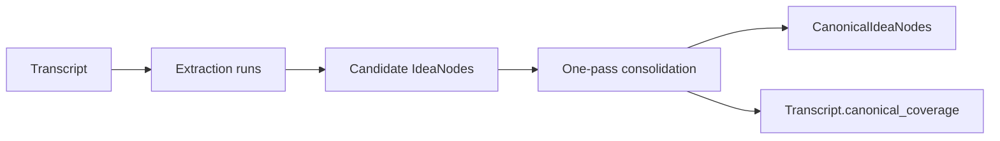
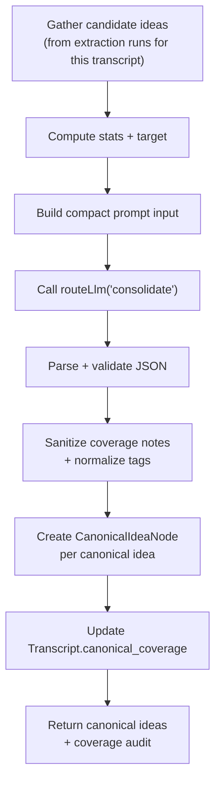
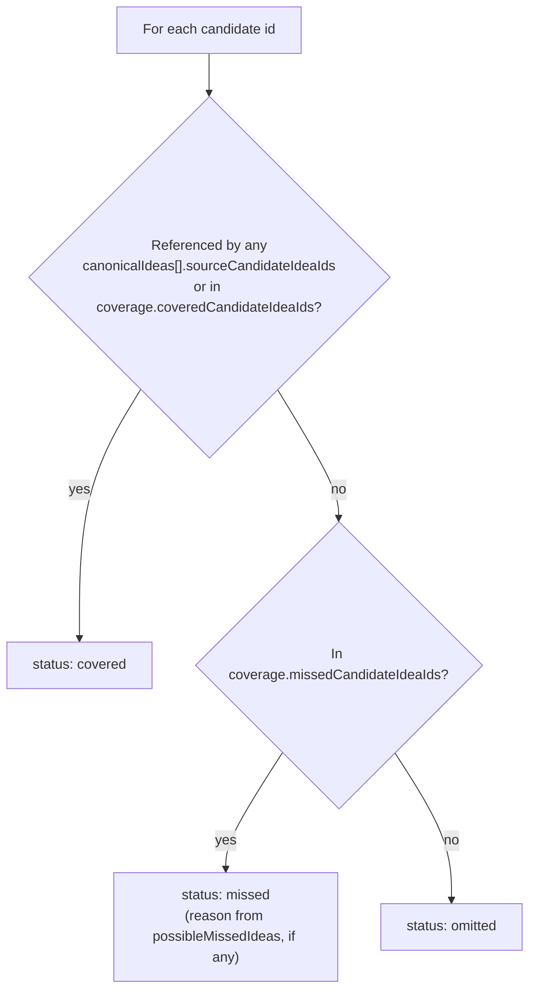

# LLAAB — Canonical Idea Consolidation

This document is the technical reference for **canonical idea consolidation**: the process that
turns candidate ideas from a transcript's extraction runs into a small set of durable,
deduplicated `canonical-idea` nodes.

The current implementation is intentionally simple: one compact prompt, one strong local model
call, deterministic cleanup, then vault writes. Earlier delegated and two-pass audit experiments
were removed after testing showed slower runtime and mixed quality for transcript-level
consolidation.

---

## Vocabulary

LLAAB uses the [glossary](../LLAAB_GLOSSARY.md) as the canonical shared vocabulary. The terms below
are specific to consolidation:

| Term                   | Meaning in consolidation                                                                  |
| ---------------------- | ----------------------------------------------------------------------------------------- |
| `candidate idea`       | An `IdeaNode` produced by an extraction run for a transcript — raw, unreviewed material.  |
| `canonical idea`       | A `CanonicalIdeaNode` — a deduplicated, durable idea derived from one or more candidates. |
| `possible missed idea` | A candidate (or cluster) the model flagged as not yet represented.                        |
| `coverage`             | Per-candidate bookkeeping: covered / omitted / missed, stored on the transcript.          |

---

## Where this fits



Consolidation is triggered manually from the transcript detail page (**Consolidate Canonical
Ideas** button) via `POST /api/vault/transcripts/:id/consolidate`. It does not run automatically —
LLAAB has no scheduler, per the agent-execution policy (`.github/instructions/project/agent-execution.instructions.md`).

Implementation entry point: `consolidateTranscriptIdeas` in
[`apps/server/src/routes/vault/vault.routes.ts`](../apps/server/src/routes/vault/vault.routes.ts).

---

## High-level pipeline



The model route is `consolidate`, configured in `configs/llm-routing.json` and editable from the
Models page (`/llm`). The current default is `gemma4:26b-a4b-it-qat`.

---

## Step 1 — Gathering candidates

For the target transcript, the handler:

1. Finds every `RunNode` whose `produced_node_ids` includes the transcript.
2. Collects every `IdeaNode` referenced by those runs' `produced_node_ids`.
3. Splits each idea's tags into `domains` (`d:*`) and `tags` (everything else) via `splitIdeaTags`.
4. Builds a `CandidateIdeaPayload` per idea:

```ts
interface CandidateIdeaPayload {
  id: string;
  runId: string;
  model?: string;
  title: string;
  body?: string;
  domains: string[];
  tags: string[];
}
```

`runId` and `model` are retained for stats, but the compact LLM input omits them. If no candidates
are found, the route returns `400 No candidate ideas found for this transcript.`

---

## Step 2 — Stats and target

Before calling the model, the handler computes two small objects. These give scale and count
guidance without forcing an exact number:

```ts
interface ConsolidationStats {
  candidateRunCount: number;
  candidateIdeaCount: number;
  averageIdeasPerRun: number;
  uniqueCandidateTagCount: number;
  sourceModels: string[];
}

interface ConsolidationTarget {
  idealMin: number; // 4
  idealMax: number; // 6
  hardMin: number; // max(3, floor(candidateIdeaCount / 8))
  hardMax: number; // min(8, ceil(candidateIdeaCount / 4))
}
```

The prompt frames the target as **"a strong preference, not a quota"** so the model can return
fewer ideas when the candidate pool genuinely collapses into fewer durable concepts.

---

## Step 3 — Compact input

`buildCanonicalInput` sends compact JSON. It never sends full transcript text, run markdown, or
`output_summary.plainText`.

```ts
type CanonicalInput = {
  transcript: { id: string; title: string; summary?: string; tags: string[] };
  stats: ConsolidationStats;
  target: ConsolidationTarget;
  candidateIdeas: Array<{
    id: string;
    title: string;
    body?: string; // truncated to 240 chars
    domains: string[];
    tags: string[];
  }>;
};
```

The input is serialized without pretty-printing to keep token count down.

---

## Step 4 — Model output

`callLlmForJson('consolidate', ...)` calls the configured model with `bypassCache: true`, extracts
the JSON object from the response, and validates it with `CanonicalDraftResultSchema`.

```ts
type CanonicalDraftResult = {
  canonicalIdeas: CanonicalIdeaDraft[];
  coverage: {
    coveredCandidateIdeaIds: string[];
    omittedCandidateIdeaIds: string[];
    missedCandidateIdeaIds: string[];
  };
  possibleMissedIdeas: PossibleMissedIdea[];
};

type CanonicalIdeaDraft = {
  title: string;
  body: string;
  tags: string[];
  domains: string[];
  confidence: 'low' | 'medium' | 'high';
  sourceCandidateIdeaIds: string[];
  keyClaims: string[];
  coverageNotes: string;
};

type PossibleMissedIdea = {
  title: string;
  reason: string;
  sourceCandidateIdeaIds: string[];
  recommendation: 'promote' | 'supporting_detail' | 'omit';
};
```

Both camelCase and snake_case field names are accepted and normalized. `confidence` and
`recommendation` values are lower-cased and clamped to valid enum values rather than rejected
outright.

---

## Prompt Rules

`buildCanonicalSystemPrompt(target)` includes:

1. **Count guidance** — target 4–6 canonical ideas, hard bounds derived from candidate count.
2. **Problem/solution merging** — merge context stuffing and targeted retrieval when they form one
   coherent problem/solution concept.
3. **Context non-determinism separation** — keep large-context non-determinism separate from
   retrieval strategy when supported by multiple candidates.
4. **Bash execution layer handling** — capture Bash as foundational but limited when supported.
5. **Typed/runtime split** — keep typed programmable execution layers separate from runtime
   isolation such as V8 isolates.
6. **Single-source handling** — single-source ideas usually become supporting details, unless
   technically central and useful for future linking.
7. **Output caps** — body max 45 words, tags max 4, domains max 3, key claims max 2.

The prompt requires every candidate id to appear exactly once across covered, omitted, or missed
coverage lists, and every canonical idea to reference at least one source candidate id.

---

## Deterministic Post-processing

Two cleanup passes run before any nodes are written.

### Sanitizing coverage notes

`sanitizeCoverageNotes(note)` replaces notes that are empty or leak internal process language:

```text
prompt, internal, consolidation process
```

Fallback:

> "Covers related candidate ideas about this concept."

### Normalizing tags

`normalizeCanonicalTags(tags, domains, title, body)`:

- Aliases known duplicate domain tags, e.g. `d:infrastructure` -> `d:infra`.
- Drops `d:ingest` unless the idea's title/body actually mentions "ingest".
- Caps semantic tags at **5** and domain tags at **3**.

Final tag list written to the node is `dedupeTags([...domains, ...tags])`.

---

## Writing canonical idea nodes

For each `CanonicalIdeaDraft`:

1. Filter `sourceCandidateIdeaIds` to ids that exist in this transcript's candidate set.
2. Drop the idea if no valid source candidate ids remain.
3. Normalize tags/domains.
4. `createNode('canonical-idea', ...)` with id `canonical-{transcriptId}-{index+1}-{timestamp}`.

The node stores:

- `transcript_id`
- `source_candidate_idea_ids`
- `confidence`
- `key_claims`
- `coverage_notes`
- `llm_model`, `llm_provider`, `llm_duration_ms`, `llm_prompt_tokens`, `llm_completion_tokens`

If zero canonical ideas survive filtering, the route returns
`422 Consolidation returned no valid canonical ideas.`

---

## Coverage tracking

`buildLegacyCoverage(candidates, result)` derives a per-candidate status:



This is written to `TranscriptNode.canonical_coverage`:

```ts
{
  canonical_idea_ids: string[];
  candidate_idea_ids: string[];
  covered_candidate_idea_ids: string[];
  omitted_candidate_idea_ids: Array<{ id: string; reason?: string }>;
  missed_candidate_idea_ids: Array<{ id: string; reason?: string }>;
  warning?: string;
  updated_at: string;
}
```

Missed candidates are surfaced in the transcript UI and can be promoted directly into a canonical
idea via `POST /transcripts/:id/canonical-ideas/promote`, independent of a full re-consolidation.

---

## Response shape

```ts
{
  success: true,
  canonicalIdeaIds: string[],
  canonicalIdeas: CanonicalIdeaNode[],
  coverageAudit: {
    coverage: Array<{ candidateId, canonicalIdeaIndexes, status, reason }>,
    missed: Array<{ candidateId, canonicalIdeaIndexes, status: 'missed', reason }>,
    warning?: string,
  },
  llmMeta: { model, provider, durationMs, promptTokens, completionTokens },
}
```

This is consumed by `useConsolidateCanonicalIdeas` and rendered in `TranscriptDetail.tsx`. On
error, the client retries the underlying queries on a backoff schedule
(30s/90s/180s/300s) in case files were written after a transient request failure.

---

## Notes on removed delegation

Delegated and two-pass audit variants were tested and removed for transcript-level consolidation:

- E4B draft plus 26B audit roughly doubled runtime in local tests.
- The delegated path produced mixed quality and extra code paths.
- Typical transcript consolidation is expected to handle tens of candidates, not hundreds.

If LLAAB later adds theme discovery across many transcripts or sources, that should start from a
fresh design with explicit batching, durable run tracking, and separate UX expectations.

---

## Key files

| File                                                                              | Responsibility                                            |
| --------------------------------------------------------------------------------- | --------------------------------------------------------- |
| `apps/server/src/routes/vault/vault.routes.ts`                                    | Consolidation handler, schemas, prompts, post-processing. |
| `packages/llm/src/router.ts`, `packages/llm/src/types.ts`                         | `TaskType` definitions and default routing.               |
| `configs/llm-routing.json`                                                        | Per-task model overrides (UI-editable).                   |
| `apps/client/src/components/LlmRoutingEditor/LlmRoutingEditor.tsx`                | Models UI task routing editor.                            |
| `apps/client/src/queries/transcripts/useConsolidateCanonicalIdeas.ts`             | Client mutation + retry/backoff.                          |
| `apps/client/src/components/TranscriptsSplitView/components/TranscriptDetail.tsx` | "Consolidate Canonical Ideas" button + coverage display.  |
| `packages/schemas/src/canonical-idea-node.schema.ts`                              | `CanonicalIdeaNode` schema.                               |
| `packages/schemas/src/transcript-node.schema.ts`                                  | `canonical_coverage` schema.                              |
