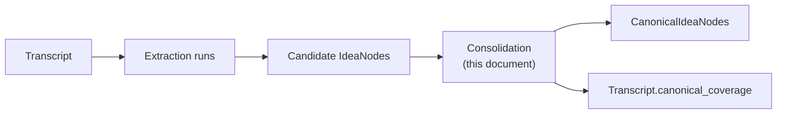
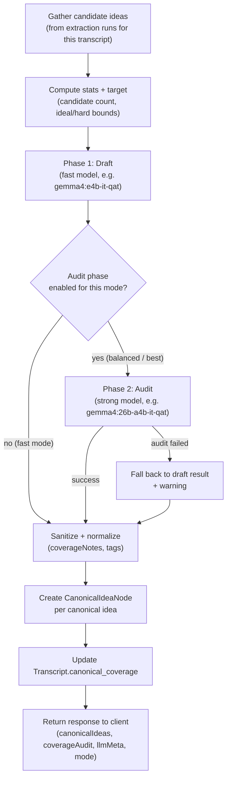
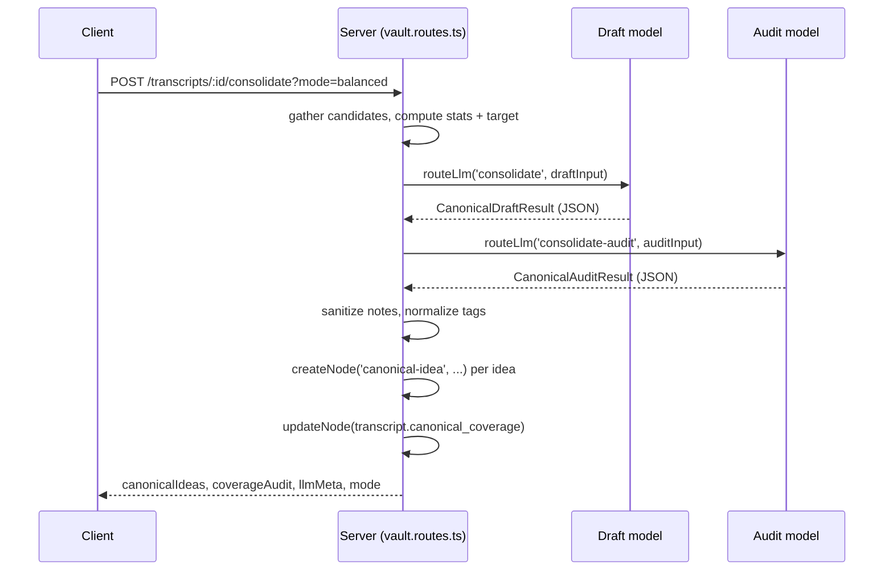
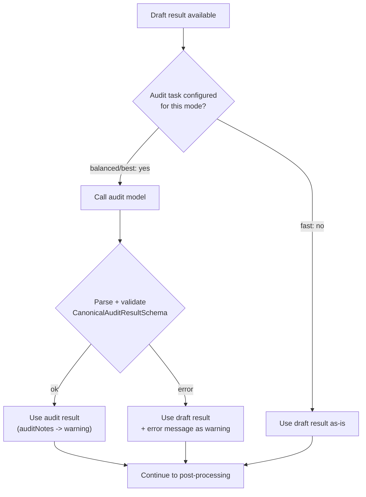
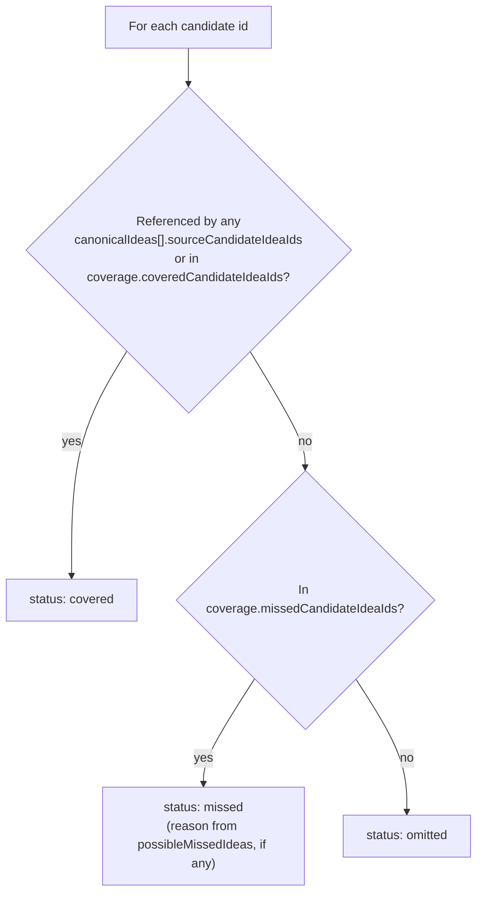

# LLAAB — Canonical Idea Consolidation

This document is the technical reference for **canonical idea consolidation**: the process that
turns the candidate ideas extracted from a transcript's extraction runs into a small set of
durable, deduplicated `canonical-idea` nodes.

It covers the two-phase Draft + Audit pipeline, the three quality modes, the input/output shapes
exchanged with the LLM, and the deterministic post-processing applied before nodes are written to
the vault.

---

## Vocabulary

LLAAB uses the [glossary](../LLAAB_GLOSSARY.md) as the canonical shared vocabulary. The terms below
are specific to consolidation:

| Term                   | Meaning in consolidation                                                                  |
| ---------------------- | ----------------------------------------------------------------------------------------- |
| `candidate idea`       | An `IdeaNode` produced by an extraction run for a transcript — raw, unreviewed material.  |
| `canonical idea`       | A `CanonicalIdeaNode` — a deduplicated, durable idea derived from one or more candidates. |
| `draft phase`          | The first LLM call: turns all candidates into a first canonical idea set.                 |
| `audit phase`          | The optional second LLM call: reviews and refines the draft set.                          |
| `possible missed idea` | A candidate (or cluster) the draft/audit model flagged as not yet represented.            |
| `coverage`             | Per-candidate bookkeeping: covered / omitted / missed, stored on the transcript.          |
| `mode`                 | `fast`, `balanced`, or `best` — controls which models run the draft and audit phases.     |

---

## Where this fits



Consolidation is triggered manually from the transcript detail page (**Consolidate Canonical
Ideas** button) via `POST /api/vault/transcripts/:id/consolidate`. It does not run automatically —
LLAAB has no scheduler, per the agent-execution policy (`.github/instructions/project/agent-execution.instructions.md`).

---

## High-level pipeline

The order is **draft first, then audit** — the audit phase reviews and refines the draft, it does
not run before it.



Implementation entry point: `consolidateTranscriptIdeas` in
[`apps/server/src/routes/vault/vault.routes.ts`](../apps/server/src/routes/vault/vault.routes.ts).

---

## Step 1 — Gathering candidates

For the target transcript, the handler:

1. Finds every `RunNode` whose `produced_node_ids` includes the transcript.
2. Collects every `IdeaNode` referenced by those runs' `produced_node_ids`.
3. Splits each idea's tags into `domains` (`d:*`) and `tags` (everything else) via `splitIdeaTags`.
4. Builds a `CandidateIdeaPayload` per idea:

```ts
interface CandidateIdeaPayload {
  id: string;
  runId: string;
  model?: string; // from IdeaNode.llm_model — which model originally extracted this idea
  title: string;
  body?: string;
  domains: string[];
  tags: string[];
}
```

If no candidates are found, the route returns `400 No candidate ideas found for this transcript.`

---

## Step 2 — Stats and target

Before calling any model, the handler computes two small objects that are sent to both the draft
and audit prompts. These give the model a sense of scale and a concrete count to aim for, without
forcing an exact number.

```ts
interface ConsolidationStats {
  candidateRunCount: number; // unique run ids among candidates
  candidateIdeaCount: number; // total candidates
  averageIdeasPerRun: number; // candidateIdeaCount / candidateRunCount
  uniqueCandidateTagCount: number; // distinct tags + domains across candidates
  sourceModels: string[]; // distinct IdeaNode.llm_model values
}

interface ConsolidationTarget {
  idealMin: number; // 4
  idealMax: number; // 6
  hardMin: number; // max(3, floor(candidateIdeaCount / 8))
  hardMax: number; // min(8, ceil(candidateIdeaCount / 4))
}
```

The target is framed to the model as **"a strong preference, not a quota"** — see
[Draft prompt rules](#draft-prompt-rules).

---

## Step 3 — Modes and model routing

Three modes control which `TaskType` is used for each phase. The mode is selected via the
`?mode=` query parameter on the consolidate request (default: `balanced`). There is currently no
UI mode selector — see [Future UX](#future-ux).

| Mode       | Draft task          | Audit task          | Behaviour                                                   |
| ---------- | ------------------- | ------------------- | ----------------------------------------------------------- |
| `fast`     | `consolidate`       | _(none)_            | Draft only. Quickest, good-enough output.                   |
| `balanced` | `consolidate`       | `consolidate-audit` | **Default.** Fast draft, then a higher-quality pass.        |
| `best`     | `consolidate-audit` | `consolidate-audit` | Highest quality, slowest. Both phases use the strong model. |

The modes resolve through `getConsolidationTasks(mode)` in `vault.routes.ts`.

Each `TaskType` is routed to an actual model via `packages/llm/src/router.ts` /
`configs/llm-routing.json`, and is editable from the **Models** page (`/llm`,
`LlmRoutingEditor.tsx`). Current defaults:

| Task                | Default model           | Tier           |
| ------------------- | ----------------------- | -------------- |
| `consolidate`       | `gemma4:e4b-it-qat`     | `local-strong` |
| `consolidate-audit` | `gemma4:26b-a4b-it-qat` | `local-strong` |



In `fast` mode, the Audit steps are skipped entirely and the draft result is used directly.

---

## Step 4 — Draft phase

### Input shape

`buildCanonicalDraftInput` sends the model a compact JSON payload — **never the full transcript
text, run markdown, or `output_summary.plainText`**:

```ts
type CanonicalDraftInput = {
  transcript: { id: string; title: string; summary?: string; tags: string[] };
  stats: ConsolidationStats;
  target: ConsolidationTarget;
  candidateIdeas: CandidateIdeaPayload[];
};
```

### Output shape

```ts
type CanonicalDraftResult = {
  canonicalIdeas: CanonicalIdeaDraft[];
  coverage: {
    coveredCandidateIdeaIds: string[];
    omittedCandidateIdeaIds: string[];
    missedCandidateIdeaIds: string[];
  };
  possibleMissedIdeas: PossibleMissedIdea[];
};

type CanonicalIdeaDraft = {
  title: string;
  body: string;
  tags: string[];
  domains: string[];
  confidence: 'low' | 'medium' | 'high';
  sourceCandidateIdeaIds: string[];
  keyClaims: string[];
  coverageNotes: string;
};

type PossibleMissedIdea = {
  title: string;
  reason: string;
  sourceCandidateIdeaIds: string[];
  recommendation: 'promote' | 'supporting_detail' | 'omit';
};
```

Validated by `CanonicalDraftResultSchema` / `CanonicalIdeaDraftSchema` /
`PossibleMissedIdeaSchema` in `vault.routes.ts`. Both camelCase and snake_case field names are
accepted and normalized (small models are inconsistent about casing), and `confidence` /
`recommendation` values are lower-cased and clamped to a valid enum rather than rejected outright.

### Draft prompt rules

`buildCanonicalDraftSystemPrompt` assembles the system prompt from:

1. **Count guidance** — the `target` range, framed as a preference:

   > Target output: 4–6 canonical ideas. Hard bounds: `{hardMin}`–`{hardMax}`. The target is a
   > strong preference, not a quota. Do not invent, pad, over-split, or promote weak ideas just to
   > hit the target.

2. **Category Separation Rule** — don't merge across categories of concern (workflow strategy,
   model behavior, historical role, interface/tooling architecture, runtime/sandboxing
   architecture, cost/performance implication) even if topically related.

3. **Problem/Solution Merge Rule** — merge a problem statement with its recommended solution into
   one canonical idea when they form one coherent concept (e.g. "context stuffing wastes tokens"
   - "targeted retrieval is more efficient" → "Context stuffing should be replaced by targeted
     retrieval").

4. **Context-Specific Rule** — context-stuffing/retrieval/token-cost candidates may merge into one
   idea, but must stay separate from a "large context windows cause non-determinism" idea (that's
   model-behavior, not context strategy).

5. **Bash-Specific Rule** — prefer one canonical idea capturing both "Bash as the first execution
   layer" and "Bash is limited" (e.g. "Bash is a foundational but limited execution layer for
   agents"), rather than always folding Bash into the typed-execution transition.

6. **Typed/Runtime Split Rule** — keep typed execution layers (TS SDKs — interface/tooling
   architecture) separate from runtime isolation (V8 isolates, sandboxing — runtime/infrastructure
   architecture).

7. **Single-Source Rule** — single-source clusters usually become supporting detail, not a
   canonical idea, unless the idea is technically specific, central to the transcript, and useful
   for future retrieval/linking — in which case mark `confidence: "medium"`.

The prompt also requires:

- Every canonical idea references at least one `sourceCandidateIdeaIds` entry.
- Every candidate id appears in exactly one of `coveredCandidateIdeaIds`,
  `omittedCandidateIdeaIds`, or `missedCandidateIdeaIds`.
- `coverageNotes` is plain-English and user-facing — never mentions drafts, audits, prompts, or
  the consolidation process itself (this is enforced again deterministically, see
  [Sanitizing coverage notes](#sanitizing-coverage-notes)).
- A closing reminder to double-check JSON validity — added because the fast draft model would
  occasionally truncate or malform JSON on the more elaborate prompt; this measurably reduced
  parse failures.

---

## Step 5 — Audit phase (optional)

Skipped entirely in `fast` mode. In `balanced` and `best` modes, `buildCanonicalAuditInput` sends:

```ts
type CanonicalAuditInput = {
  transcript: { id: string; title: string; summary?: string; tags: string[] };
  stats: ConsolidationStats;
  candidateIdeas: CandidateIdeaPayload[];
  draft: CanonicalDraftResult; // the full output of Step 4
};
```

The audit model receives the **same rule set** as the draft (count guidance + all six rules above)
plus an explicit checklist (`AUDIT_RESPONSIBILITIES`):

1. Are any canonical ideas duplicates?
2. Are distinct concepts over-merged?
3. Are related problem/solution pairs unnecessarily split?
4. Are important candidate clusters missing?
5. Are weak/single-source ideas promoted unnecessarily?
6. Are `sourceCandidateIdeaIds` accurate?
7. Is the final count within the target range?
8. Are tags clean and reusable (≤5 semantic, ≤3 domain)?
9. Are domain tags appropriate (no noisy `d:ingest` unless the idea is actually about ingestion)?
10. Do `coverageNotes` avoid internal process language?

**V1 output shape**: the audit returns the _finalized_ canonical idea set directly (same shape as
`CanonicalDraftResult`, plus `auditNotes: string[]` — a short, non-user-facing summary of what
changed). The MD spec also describes an alternative `AuditAction` (`keep` / `merge` / `split` /
`demote_to_supporting_detail` / `promote_possible_missed_idea` / `rename` / `retag`) action-list
output — **not implemented**; deferred for a future iteration if "return the full set" proves too
expensive for large candidate pools.

If the audit call throws (LLM error, schema validation failure, malformed JSON), the handler
**falls back to the draft result** and records a warning — consolidation never fails purely
because the audit step failed.



---

## Step 6 — Deterministic post-processing

Two cleanup passes run on the _final_ result (draft or audit) before any nodes are written —
these are pure functions, not model calls, so they apply consistently regardless of mode.

### Sanitizing coverage notes

`sanitizeCoverageNotes(note)` rejects notes that leak internal process language. If the
(lower-cased) note contains any of:

```text
draft 0, draft 1, draft 2, audit, prompt, internal, consolidation process,
overarching narrative formed by combining drafts
```

...or is empty, it is replaced with the fallback:

> "Covers related candidate ideas about this concept."

### Normalizing tags

`normalizeCanonicalTags(tags, domains, title, body)`:

- Aliases known duplicate domain tags, e.g. `d:infrastructure` → `d:infra`.
- Drops `d:ingest` unless the idea's title/body actually mentions "ingest".
- Caps semantic tags at **5** and domain tags at **3** (after deduping via `dedupeTags`).

Final tag list written to the node is `dedupeTags([...domains, ...tags])`.

---

## Step 7 — Writing canonical idea nodes

For each `CanonicalIdeaDraft` in the final result:

1. Filter `sourceCandidateIdeaIds` to only ids that exist in this transcript's candidate set. If
   none remain, the idea is **dropped** (it referenced ids outside this run's candidate pool).
2. Normalize tags/domains (Step 6).
3. `createNode('canonical-idea', ...)` with id `canonical-{transcriptId}-{index+1}-{timestamp}`,
   storing:
   - `transcript_id`, `source_candidate_idea_ids`, `confidence`, `key_claims`, `coverage_notes`
   - `llm_model` / `llm_provider` / `llm_duration_ms` / `llm_prompt_tokens` /
     `llm_completion_tokens` — taken from whichever phase produced the _final_ result (audit, if
     it ran and succeeded; otherwise draft).

If **zero** canonical ideas survive filtering, the route returns
`422 Consolidation returned no valid canonical ideas.`

---

## Step 8 — Coverage tracking

`buildLegacyCoverage(candidates, result)` derives a per-candidate status for every candidate idea,
for both the persisted transcript field and the client response:



This is written to `TranscriptNode.canonical_coverage`:

```ts
{
  canonical_idea_ids: string[];          // ids of nodes created this run
  candidate_idea_ids: string[];          // all candidates considered
  covered_candidate_idea_ids: string[];
  omitted_candidate_idea_ids: Array<{ id: string; reason?: string }>;
  missed_candidate_idea_ids: Array<{ id: string; reason?: string }>;
  warning?: string;                      // audit failure message and/or auditNotes, joined
  updated_at: string;                    // ISO timestamp
}
```

`missed` candidates are surfaced in the transcript UI and can be promoted directly into a
canonical idea via `promoteCanonicalIdea` (`POST /transcripts/:id/canonical-ideas/promote`),
independent of a full re-consolidation.

---

## Response shape

```ts
{
  success: true,
  canonicalIdeaIds: string[],
  canonicalIdeas: CanonicalIdeaNode[],
  coverageAudit: {
    coverage: Array<{ candidateId, canonicalIdeaIndexes, status, reason }>,
    missed: Array<{ candidateId, canonicalIdeaIndexes, status: 'missed', reason }>,
    warning?: string,
  },
  llmMeta: { model, provider, durationMs, promptTokens, completionTokens },
  mode: 'fast' | 'balanced' | 'best',
}
```

This is consumed by `useConsolidateCanonicalIdeas` (`apps/client/src/queries/transcripts/`) and
rendered in `TranscriptDetail.tsx`. On error, the client retries the underlying queries on a
backoff schedule (30s/90s/180s/300s) in case the failure was transient.

---

## Worked example

For the transcript _"The language holding our agents back"_ (~20–30 candidate ideas across
multiple extraction runs), `balanced` mode produced:

1. Targeted retrieval should replace context stuffing (token efficiency / search optimization)
2. Bash is a foundational but limited execution layer for agents
3. Typed, programmable execution layers provide safer agent interactions
4. V8 isolates enable lightweight, multi-tenant sandboxing for AI agents
5. Large context windows can increase LLM non-determinism and degrade performance

— five canonical ideas, each mapping cleanly to one category of concern, matching the target range
of 4–6. The audit phase's `auditNotes` for this run recorded: it merged Bash's "foundation" and
"limitations" candidates into one idea, separated the context-window non-determinism candidate
from the retrieval-strategy idea, and folded a single-source tokenization candidate into the
context-management idea as supporting detail — concrete examples of the Category Separation,
Context-Specific, and Single-Source rules in action.

---

## Tuning models

To change which model handles `consolidate` or `consolidate-audit`:

- **UI**: `/llm` page → Task routing → pick a model for "Consolidation" or "Consolidation Audit".
- **Config file**: edit `configs/llm-routing.json` directly (same shape the UI writes).

Both phases must point at models that are installed in Ollama (`ollama list`); the UI shows an
"Available" / "Not installed" indicator per task.

---

## Future UX

Per the original design notes:

- Keep the primary button simple: **"Consolidate Canonical Ideas"** (currently always `balanced`).
- A future mode selector (Fast / Balanced / Best) can pass `?mode=` through
  `useConsolidateCanonicalIdeas` without any server changes — the `mode` param is already
  implemented and validated (`parseConsolidationMode`, defaulting to `balanced` for any
  unrecognized value).
- Consider persisting the consolidation run itself as a `RunNode` (draft model, audit model, mode,
  token/duration totals, input candidate count, output canonical count) for traceability —
  not yet implemented.

---

## Key files

| File                                                                              | Responsibility                                            |
| --------------------------------------------------------------------------------- | --------------------------------------------------------- |
| `apps/server/src/routes/vault/vault.routes.ts`                                    | Consolidation handler, schemas, prompts, post-processing. |
| `packages/llm/src/router.ts`, `packages/llm/src/types.ts`                         | `TaskType` definitions and default routing.               |
| `configs/llm-routing.json`                                                        | Per-task model overrides (UI-editable).                   |
| `apps/client/src/components/LlmRoutingEditor/LlmRoutingEditor.tsx`                | Models UI task routing editor.                            |
| `apps/client/src/queries/transcripts/useConsolidateCanonicalIdeas.ts`             | Client mutation + retry/backoff.                          |
| `apps/client/src/components/TranscriptsSplitView/components/TranscriptDetail.tsx` | "Consolidate Canonical Ideas" button + coverage display.  |
| `packages/schemas/src/canonical-idea-node.schema.ts`                              | `CanonicalIdeaNode` schema.                               |
| `packages/schemas/src/transcript-node.schema.ts`                                  | `canonical_coverage` schema.                              |
