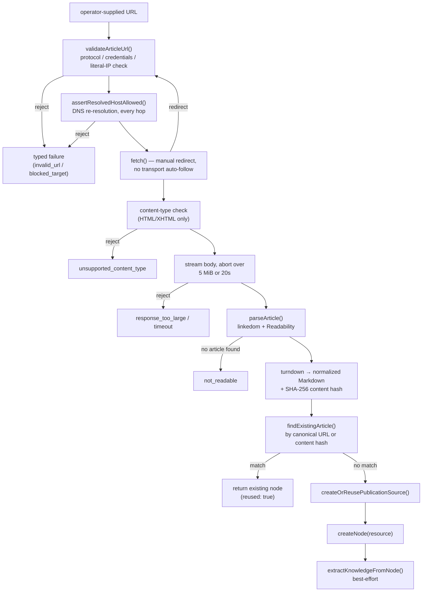

# Article Ingestion

Documents the ingestion pipeline for public article/blog URLs: how a page is fetched safely,
parsed deterministically, and stored as an article `resource` node in the vault.

For the transcript-shaped ingestion pipelines (YouTube, podcast), see
[06 — YouTube Transcript Ingestion](06_YOUTUBE_TRANSCRIPT_INGESTION.md). Article ingestion reuses
that pipeline's save-first / extract-second boundary but stores a `resource` node instead of a
`transcript` node, because an article is not a transcript. Full delivery record, product decisions,
and validation evidence: [`docs/todo/DONE_ARTICLE_INGESTION.md`](todo/DONE_ARTICLE_INGESTION.md).

---

## Overview

Same two-phase shape as transcript ingestion — save always completes first; extraction is
best-effort:

| Phase      | What happens                                                                                  |
| ---------- | --------------------------------------------------------------------------------------------- |
| 1. Ingest  | bounded fetch → deterministic parse → store article `ResourceNode` + publication `SourceNode` |
| 2. Extract | LLM extracts ideas + summary → create `IdeaNode`s, update the resource's `description` field  |

Phase 1 never fails due to LLM issues. Phase 2 failure is surfaced as a warning
(`extractionError` in the API response; a run event on the durable run) but the article is always
persisted.

Only one explicit URL is ingested per call — no crawling, feed scanning, or link traversal. PDFs,
Office documents, paywalled pages, and JavaScript-rendered pages are explicitly out of scope; a
future, separate "Document Ingestion" path (local upload + `liteparse`) is tracked on the roadmap
and does not share this pipeline.

---

## Access Points

| Entry point                     | Where                                                                                                                                                                                                                                                                                                 |
| ------------------------------- | ----------------------------------------------------------------------------------------------------------------------------------------------------------------------------------------------------------------------------------------------------------------------------------------------------- |
| `/ingest` client page           | Paste or drop any non-YouTube, non-Pocket-Casts HTTP(S) URL — classified as an `article` source kind and submitted like any other ingest                                                                                                                                                              |
| `POST /api/ingest/article`      | `apps/server/src/routes/ingest/ingest.routes.ts` — `{ url, title?, tags?, skipExtraction?, inboxCaptureId? }`                                                                                                                                                                                         |
| `vault_ingest_article` MCP tool | `packages/cli/src/mcp/server.ts` — same authenticated API boundary as the other ingest tools                                                                                                                                                                                                          |
| Hermes `docs:` / `post:`        | Explicit prefix on a Telegram/Discord inbox message routes to `ingest_article`; the inbox capture is written **before** the fetch is attempted, so a failed ingest never loses the operator's link. An unprefixed link stays a plain `capture_web_link` — nothing is fetched unless explicitly asked. |
| `POST /api/runs/:id/retry`      | Retries a failed `ingest-article` run using its original `input_summary`                                                                                                                                                                                                                              |

---

## Key Files

| File                                                       | Role                                                                    |
| ---------------------------------------------------------- | ----------------------------------------------------------------------- |
| `packages/ingestion/src/fetch/article/fetch-article.ts`    | Bounded fetch: redirect revalidation, size cap, MIME check              |
| `packages/ingestion/src/fetch/article/article.url.ts`      | SSRF guard — URL validation + DNS re-resolution                         |
| `packages/ingestion/src/fetch/article/article.parse.ts`    | Readability parse + metadata precedence                                 |
| `packages/ingestion/src/fetch/article/article.markdown.ts` | HTML → Markdown normalization, truncation, content hashing              |
| `packages/ingestion/src/article/create-article-nodes.ts`   | Save-first pipeline: dedupe, publication source, resource node          |
| `packages/ingestion/src/pipeline.ts`                       | `extractKnowledgeFromNode` — source-neutral extraction primitive        |
| `packages/skills/src/ingest-article.ts`                    | Entry point — runs the pipeline under `runSkill`, then tries extraction |
| `apps/server/src/routes/ingest/ingest.routes.ts`           | `POST /api/ingest/article` handler                                      |
| `packages/core/src/hermes-inbox-router.ts`                 | Routes `docs:`/`post:` prefixes to `ingest_article`                     |

---

## Services Called

```
ingestArticle (skill)
    │
    ▼
createArticleNodes
    │
    ├──▶ fetchArticle           (packages/ingestion/src/fetch/article/)
    │      ├──▶ validateArticleUrl + assertResolvedHostAllowed   — SSRF guard, re-run per redirect hop
    │      ├──▶ fetch()          — manual redirect following, streamed size cap
    │      └──▶ parseArticle     — linkedom + @mozilla/readability + turndown (no LLM)
    │
    ├──▶ findExistingArticle     (@llaab/core listNodes)  — dedupe by canonical URL or content hash
    ├──▶ createOrReusePublicationSource                   — SourceNode keyed by site origin
    └──▶ createNode              (@llaab/core)            — persists the article ResourceNode

extractKnowledgeFromNode        (best-effort, after save)
    │
    ├──▶ llmExtractWithTrace     (@llaab/control → routeLlm('extract', ...))
    ├──▶ createNode              — one IdeaNode per extracted idea
    └──▶ updateNode              — writes `description` (not `summary` — see Node Shape) + LLM trace
```

No LLM is involved in fetching or parsing. The only model call in this whole pipeline is the
extraction step, and it runs entirely after the article is durably saved.

---

## Fetch Pipeline (Flow)



Every rejection above is a typed, closed failure code (`ArticleFetchFailureCode`) — never a thrown
string — and URLs on a failure are stripped of any embedded credentials before they reach a run
event or log line.

---

## Safety Contract

| Concern        | Behavior                                                                                                                             |
| -------------- | ------------------------------------------------------------------------------------------------------------------------------------ |
| Protocol       | `http:`/`https:` only; a redirect may upgrade to `https:` but never downgrade                                                        |
| Credentials    | URLs containing userinfo (`user:pass@host`) are rejected                                                                             |
| Network target | Localhost, loopback, private, link-local, multicast, and reserved IPv4/IPv6 ranges are blocked                                       |
| DNS            | Re-resolved immediately before **every** request, including each redirect hop — closes DNS-rebinding and redirect-to-private attacks |
| Redirects      | Followed manually, max 5 hops, each one fully revalidated                                                                            |
| Timeout        | 20s for the complete fetch                                                                                                           |
| Response size  | 5 MiB, enforced while streaming — `Content-Length` is never trusted alone                                                            |
| Content type   | HTML/XHTML only; anything else (PDF, images, JSON, …) is `unsupported_content_type`                                                  |
| Readable text  | At least 200 non-whitespace characters after Readability extraction, or `not_readable`                                               |
| Stored size    | Markdown capped at 500,000 characters; truncation is flagged (`content_truncated`) not silent                                        |

---

## Accepted Input

- **Format:** any public `http(s)://` URL serving `text/html` or `application/xhtml+xml`.
- **Not accepted:** PDFs, Office documents, images, paywalled or authenticated pages, and
  JavaScript-rendered (client-only) pages — all fail with a typed error and create no nodes.
- **Identity:** the _canonical_ URL (from `<link rel="canonical">` or `og:url`, only trusted when
  same-host as the response — otherwise the response URL itself) is the durable identity used for
  dedupe. The originally requested URL (which may carry tracking parameters or be a redirect/
  shortener) is retained separately as `requested_url`.

---

## Node Shape

Article ingestion produces two node types:

### Publication `SourceNode`

One per site, keyed by normalized origin (`https://example.com`), reused across every article from
that site:

```yaml
type: source
source_kind: publication
title: <site name, or hostname fallback>
url: <site origin>
platforms: [website]
profiles: [{ platform: website, url: <origin>, primary: true }]
related: [<article resource ids that came from this site>]
```

### Article `ResourceNode`

```yaml
type: resource
resource_type: article
title: <fetched title, or operator override>
url: <canonical URL>              # durable identity
requested_url: <as originally supplied>
source_id: <publication SourceNode id>
description: <excerpt, then LLM summary once extraction succeeds>
author: <byline, when declared>
site_name: <publication name>
source_published_at: <ISO 8601 UTC, when declared>
fetched_at: <ISO 8601 UTC>
content_hash: <SHA-256 of normalized plain text>
content_truncated: <bool>
extracted_idea_ids: [<idea node ids, after extraction>]
tags: [d:ingest, ...auto tags, ...manual tags]
related: [<originating inbox capture id>, when ingested via Hermes docs:/post:]
```

Body is readable Markdown, not raw HTML:

```markdown
# <title>

[<canonical URL>](<canonical URL>)
**author:** <byline>
**publication:** <site name>
**published:** <date>
**fetched:** <date>

## Article

<cleaned article content>
```

Note the field name split: `ResourceNode` has no `summary` field, so the extraction primitive
writes the summary into `description` here — every other node type (transcript, etc.) uses
`summary`. This is a real Zod trap: writing the wrong key is silently dropped by the schema, not
rejected, so the primitive branches on node type deliberately.

---

## Deduplication

Before creating anything, the pipeline checks existing `resource` nodes of `resource_type:
'article'` for a match on **either** the canonical URL **or** the content hash — so an article that
moves to a new URL (a site migration, a shortener pointing somewhere new) is still recognized as
the same content. On a match, the existing node is returned with `reused: true` and no new nodes
are written.

---

## Running Ingestion

```bash
curl -X POST http://localhost:8888/api/ingest/article \
  -H "Content-Type: application/json" -H "X-API-Key: $LLAAB_API_KEY" \
  -d '{"url":"https://example.com/some-article"}'
```

Or via the skill directly:

```bash
pnpm exec bun -e "
import { ingestArticle } from './packages/skills/src/ingest-article.ts';
await ingestArticle({ url: 'https://example.com/some-article', tags: ['my-tag'] });
"
```

Live smoke test against a real URL, outside the automated suite (every fixture-backed test in
`packages/ingestion/src/fetch/article/` runs with no network access):

```bash
bun packages/ingestion/src/fetch/article/smoke-fetch-article.ts <url>
```

---

## Troubleshooting

| Symptom                                        | Likely cause                                                                                         | Fix                                                                                                                                   |
| ---------------------------------------------- | ---------------------------------------------------------------------------------------------------- | ------------------------------------------------------------------------------------------------------------------------------------- |
| `blocked_target`                               | URL resolves to a private/loopback/link-local address                                                | Expected — the target is out of scope by design, not a bug                                                                            |
| `unsupported_content_type`                     | URL serves a PDF, image, or other non-HTML type                                                      | Expected — use a future document-ingestion path once it exists (not this one)                                                         |
| `not_readable`                                 | Page has no extractable article text (client-rendered shell, thin stub, or under the 200-char floor) | Expected for JS-only pages; not fixable from this pipeline                                                                            |
| Re-ingest returns `reused: true`               | Canonical URL or content hash matched an existing article                                            | Expected; discard the existing resource first if a true refresh is wanted                                                             |
| Extraction failed — article saved              | LLM model not running or misrouted                                                                   | Check the `extract` task route in `configs/llm-routing.json`                                                                          |
| `docs:`/`post:` capture kept but ingest failed | Fetch/parse failed after the inbox capture was written                                               | Expected — capture-before-ingest ordering; the inbox item is never dropped                                                            |
| Publication source deleted on discard          | Would only happen if retention logic regressed                                                       | `resource_type: article` nodes referencing a source must block its deletion — see `apps/server/src/routes/vault/vault-runs.routes.ts` |
